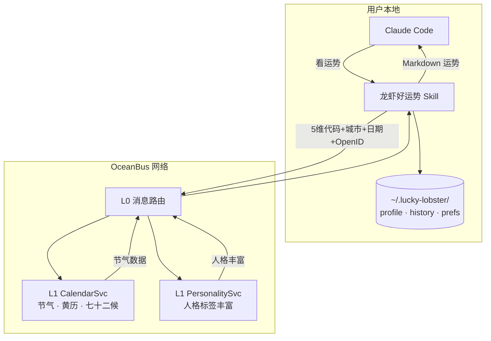

# 🌊 龙虾好运势 — 说一句「看运势」，剩下的交给小龙虾

**不看星座，不填问卷。从你的对话、工作、思考方式里读懂你。**

[](https://clawhub.ai/skills/lobster-haoyun)
[](https://github.com/ryanbihai/lobster-haoyun)
[](https://www.npmjs.com/package/oceanbus)
[](LICENSE)

---

## 📑 目录

- [这是什么](#这是什么)
- [快速开始](#快速开始)
- [能力一览](#能力一览)
- [架构](#架构)
- [本地测试](#本地测试)
- [安全与隐私](#安全与隐私)
- [相关项目](#相关项目)
- [参与贡献](#参与贡献)
- [License](#license)

---

## 这是什么

龙虾好运势是一个基于 OceanBus 的 ClawHub Skill。跟市面上所有运势产品不一样——它不问你生日，不让你填问卷。它从你的对话历史、记忆文件、工作模式里观察你，然后告诉你一些关于你自己的、有证据的事。

**首次读心**会给你一篇深度解读——底色、驱动力、盲区、能量模式。每条判断带着具体证据："说你是这种人，是因为我看到了这个"。

**每日运势**融合二十四节气和七十二候：小满、芒种、麦秋至……用自然界的节奏隐喻你的状态变化。

**周日回顾**自动复盘这一周："上次说你是布局者，这周看到你开始往执行转了"。

```
你 ⟷ Claude Code ⟷ OB L0 ⟷ L1 CalendarSvc (ECS)
                         ⟷ L1 PersonalitySvc (ECS)
```

> 📖 **深度阅读**：[SKILL.md](./SKILL.md) — LLM 行为指南与完整协议文档

---

## 快速开始

```bash
# 1. 安装
clawhub install lobster-haoyun

# 2. 在 Claude Code 中说
看运势

# 3. 验证底座连通性
node src/index.js --action status
```

首次使用会自动创建 OceanBus 匿名身份（`~/.lucky-lobster/ob-credentials.json`），无需任何配置。

---

## 能力一览

| 能力 | 说明 |
|------|------|
| **深度读心** | 6 步分析引擎：场景判断 → 特征提炼 → 人格匹配 → 盲区推断 → 建议生成 → 渲染输出 |
| **证据引用** | 7 种说服技术静默应用——每条判断后面跟具体证据，不是泛泛的"你很优秀" |
| **每日运势** | Aha Moment 引擎——节气 × 人格标签 × 近期行为，每天一条微行动建议 |
| **周回顾** | 每周日自动触发——追踪人格洞察变化，回顾本周进展 |
| **定时推送** | 首次读心后可一键开启每日 7:30 自动运势提醒（CC CronCreate） |
| **隐私优先** | 数据分流——对话内容本地处理，仅5维代码+城市+日期+OpenID 经 OB L0 加密传输 |

---

## 架构



---

## 本地测试

```bash
# 底座状态（OB 身份 + 画像 + 历史）
node src/index.js --action status

# 完整运势数据（含 L1 日历数据，需 L1 服务在线）
node src/index.js --action fortune

# 直接调用 L1 CalendarSvc
node src/index.js --action l1-calendar
```

---

## 安全与隐私

- **对话内容永不上传**——完整对话、项目名、人名、文件内容仅本地处理
- **通过 OceanBus 加密通道发送以下数据到 L1 服务**：
  - 5维行为代码（如"架精事内理"）——不含具体对话内容
  - 城市级位置（仅当用户填写了城市）
  - 查询日期 ——用于黄历节气数据
  - OceanBus OpenID（密码学随机生成）——L1 用于关联请求与响应
- **本地存储**：`~/.lucky-lobster/` 存放 OB 身份凭据、行为画像、运势历史、推送偏好、同意记录
- **OpenID 可随时清除**——删除 `~/.lucky-lobster/` 即永久清除身份，下次自动生成新身份
- **每日推荐（Skill/公开课）**：发送 OpenID 给 L1 用于去重，不含广告追踪
- **不含广告追踪**——不收集兴趣标签，不发送给第三方广告商

---

## 相关项目

| 项目 | 说明 |
|------|------|
| [oceanbus](https://www.npmjs.com/package/oceanbus) | 核心 SDK — `npm install oceanbus` |
| [Ocean Chat](https://clawhub.ai/skills/ocean-chat) | P2P 消息与黄页发现 |
| [Captain Lobster](https://clawhub.ai/skills/captain-lobster) | 零玩家 AI 交易游戏 |
| [Find Agent](https://clawhub.ai/skills/find-agent) | OceanBus 黄页搜索 |
| [Guess AI](https://clawhub.ai/skills/guess-ai) | 多人 AI 推理游戏 |

---

## 参与贡献

龙虾好运势是 MIT-0 协议的开源项目，欢迎贡献。

- **GitHub**: [ryanbihai/lobster-haoyun](https://github.com/ryanbihai/lobster-haoyun)
- **可参与方向**: 人格标签文案打磨、Aha Moment 节气模板补充、情感型用户场景测试
- **深度阅读**: [SKILL.md](./SKILL.md) — LLM 行为指南与完整协议文档

---

## License

MIT-0 — 自由使用、修改、分发。无需署名。
